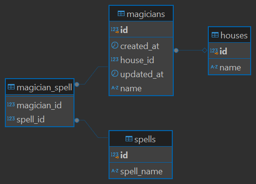

# Hogwarts API

## Project Description

This project is a **RESTful API** developed using **Spring Boot**, inspired by the Harry Potter universe. The API allows users to manage characters, spells, and houses within the magical world of Hogwarts. It implements a basic CRUD (Create, Read, Update, Delete) functionality for entities like **Magician**, **House**, and **Spell**, enabling users to interact with the data through various endpoints.

## Steps to Run the Application and Execute Tests

### 1. Prerequisites

Ensure you have the following tools installed on your machine:

- **Java 17 or higher**: To run the Spring Boot application.
- **Maven**: For building and running the application.
- **Docker**: For running the PostgreSQL database in a container (if you are using Docker instead of a local database).
- **PostgreSQL**: If you prefer not to use Docker, install PostgreSQL locally to manage the database.

> **Note**: If you are using Docker for the database, ensure that **Docker Desktop** is running before starting the application.
If you are using Docker for the database, execute the following command to start the PostgreSQL container:

### 2. **Clone the Repository**

To get started, clone the repository to your local machine:

```bash
git clone https://github.com/your-username/hogwarts-api.git
cd hogwarts-api
```

### 3. Start the PostgreSQL database (if using Docker):
```bash
docker-compose up -d
```

### 4. Build and run the application
```bash
./mvnw spring-boot:run
```

### 5. Executing tests
Run the following command to execute the tests:
```bash
./mvnw test
```

## Database E/R Model


## Profiles
In this project, I use Spring Boot profiles to manage configurations for different environments. I have two profiles configured: dev (development) and test (testing).

In the application.properties file, I specify the active profile by setting the spring.profiles.active property.
The dev profile uses a PostgreSQL database hosted on Render for the development environment.
The test profile is used for running automated tests, and it is configured with a test-specific database.
You can switch between profiles by modifying the spring.profiles.active property in the application.properties file or passing the profile as a command-line argument.

### API Endpoints and Usage Examples
### API Endpoints

#### Houses

- **GET /api/houses**
  Description: Retrieves a list of all houses.

- **GET /api/houses/{id}**
  Description: Retrieves a specific house by its ID.

- **POST /api/houses**
  Description: Creates a new house.

- **PUT /api/houses/{id}**
  Description: Updates an existing house.

- **DELETE /api/houses/{id}**
  Description: Deletes a house by its ID.

#### Magicians

- **GET /api/magicians**
  Description: Retrieves a list of all magicians.

- **GET /api/magicians/{id}**
  Description: Retrieves a specific magician by their ID.

- **POST /api/magicians**
  Description: Creates a new magician.

- **PUT /api/magicians/{id}**
  Description: Updates an existing magician.

- **DELETE /api/magicians/{id}**
  Description: Deletes a magician by their ID.

#### Spells

- **GET /api/spells**
  Description: Retrieves a list of all spells.

- **GET /api/spells/{id}**
  Description: Retrieves a specific spell by its ID.

- **POST /api/spells**
  Description: Creates a new spell.

- **PUT /api/spells/{id}**
  Description: Updates an existing spell.

- **DELETE /api/spells/{id}**
  Description: Deletes a spell by its ID.
#### Houses

- **Get all houses**  
  `GET /api/houses`  
  **Description**: Retrieves a list of all houses.  
  **Example**:
  ```bash
  curl http://localhost:8080/api/houses
